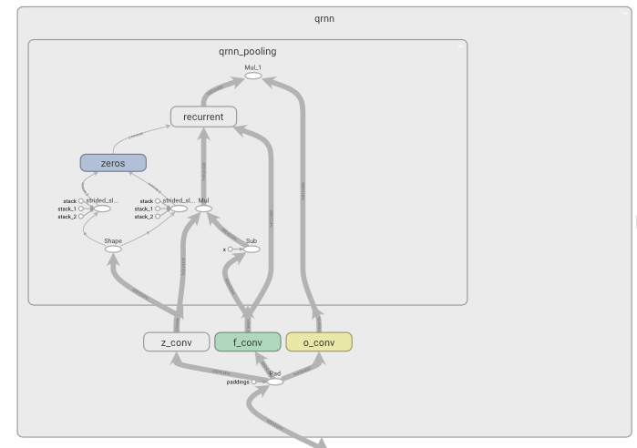

# quasi-rnn

Tensorflow 2 version of Quasi-Recurrent Neural Network ([Bradbury et al., 2016](https://arxiv.org/abs/1611.01576)).

## Model

Graph when `pooling_method = "fo"`.



## Usage

Because the model code is simple, there is no pip package. Just copy and paste `qrnn.py`.

```python
import tensorflow as tf
from qrnn import QRNN

qrnn = QRNN(
  hidden_size=320,
  kernel_size=2,
  zoneout_prob=0.1,
  pooling_method='fo',
  activation=tf.nn.tanh,
  gate_activation=tf.nn.sigmoid,
  kernel_regularizers=tf.keras.regularizers.L2(l2=4e-6),
)
qrnn(tf.random.uniform((10, 20, 30)))
```

## TODO

- [x] Zoneout
- [ ] Optimize for GPU
- [ ] Training codes
